ProJIVE and CJIVE
================

# Short Introudction

This document serves as an illustrative example of JIVE analysis using
both Canonical JIVE (i.e. CJIVE which is equivalent to AJIVE given the
same joint and individual ranks) and the EM algorithm-based ProJIVE.
Details of the ProJIVE model for JIVE analyses can be found in the
Probabilistic JIVE manuscript. Here, we use simulated (i.e. toy) data to
compare. In order to follow along with the analyses presented herein,
please make sure to download the file “Functions\_to\_SimulateData.R”
from our GitHub page github.com/BenjaminRisk/ProJIVE and save it in the
same directory as this document. Both the program to simulate data and
ProJIVE are currently designed to handle exactly \(K = 2\) data sets.

## Input Parameters

Input parameters for generating data include the following quantities:
\(n\) - number of subjects; \(p_k\) - number of features in \(k^{th}\)
data block (\(k=1,2\)); \(r_J\) - joint rank; \(r_{Ik}\) - individual
rank for \(k^{th}\) data block; \(R_{Jk}^2\) - proportion of total
variation n \(k^{th}\) data block attributable to the joint signal;
\(R_{Ik}^2\) - proportion of total variation n \(k^{th}\) data block
attributable to it’s individual signal. Note: the last parameters
described were portions and therefore require
\(R_{Jk}^2 + R_{Ik}^2 \leq 1\) for each \(k\). The use may also set a
‘seed number.’ We use seed number = 0.

``` r
# Sample size and number of features per block
n = 100
p1 = 30
p2 = 50 

# Ranks (joint, followed by individual rank for each block)
r.J = 1
r.I1 = 2
r.I2 = 2

# Proportions of joint variation explained
JntVarEx1 = 0.05 
JntVarEx2 = 0.5

# Proportions of individual variation explained
IndVarEx1 = 0.25
IndVarEx2 = 0.25
```

## Simulated Toy Datasets

In addition to the input parameters defined above, the function
“GenToyDatBinRank” has the following parameters: ‘equal.eig’ - logical
(TRUE/FALSE), which allows the user to specify whether components within
a data-blocks joint (or individual) signal should be equally waited. The
default is FALSE

‘JntVarAdj’ - logical (TRUE/FALSE): Specify whether signal matrices
should be weighted to achieve the desired proportions of variation
attributable to the joint signal

‘SVD.plots’ - logical (TRUE/FALSE): Should plots of signal matrix
singular values be produced to verify ranks?

‘Error’ - logical (TRUE/FALSE): Should the data be noise-contaminated?

‘print.cor’ - logical (TRUE/FALSE), Print the correlation matrix for the
scores? (Allows check for orthoganility between scores/compnents)

‘Loads’ - char: Toy data can be generated with loadings from ‘Gaussian’,
‘Rademacher’, or ‘Double\_Exp’ (double exponential) distributions.
Loadings can also be fixed at binary (0/1) values assigned to half of
the variables

‘Scores’ - char: Scores can be randomly generated from ‘Gaussian’,
‘Binomial’, or ‘Gaussian\_Mixture’ distributions.

``` r
true_signal_ranks = r.J + c(r.I1,r.I2)                          ##true ranks of overall signals
ToyDat = GenerateToyData(n = n, p1 = p1, p2 = p2, JntVarEx1 = JntVarEx1, JntVarEx2 = JntVarEx2, 
                         IndVarEx1 = IndVarEx1, IndVarEx2 =  IndVarEx2, jnt_rank = r.J,
                         equal.eig = F,ind_rank1 = r.I1, ind_rank2 = r.I2, JntVarAdj = T, SVD.plots = T,
                         Error = T, print.cor = F, Loads = "Gaussian", Scores = "Gaussian")
```

    ## [1] "Generating Scores from Gaussian distribution and Loadings from Gaussian"

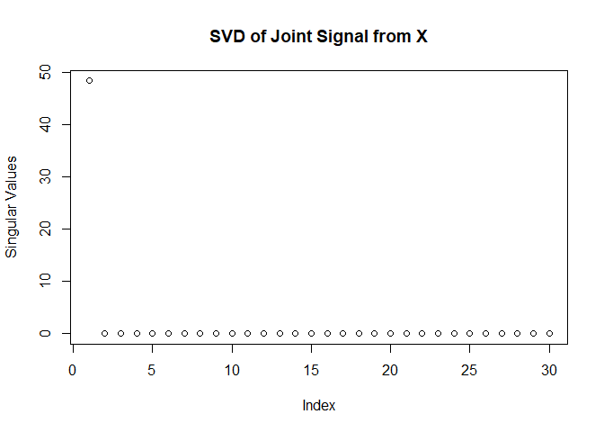<!-- -->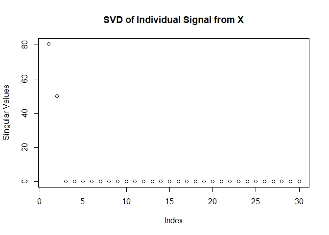<!-- --><!-- --><!-- -->

Check that values of \(R_{Jk}^2\) and \(R_{Ik}^2\) in the simulated data
match the desired quantities.

    ## paste(R[JX]^2, "=", 0.0499)

    ## paste(R[JY]^2, "=", 0.0499)

    ## paste(R[IX]^2, "=", 0.2494)

    ## paste(R[IY]^2, "=", 0.2494)

Now, compute the CJIVE solution and graph joint subject scores (not
individual scores) in addition to joint and individual loadings.

``` r
#### CJIVE
CJIVE.res = cc.jive(blocks, true_signal_ranks, r.J, perm.test = FALSE)

# CJIVE signal matrix estimates
J.hat = CJIVE.res$sJIVE$joint_matrices
I.hat = CJIVE.res$sJIVE$indiv_matrices

# CJIVE loading estimates
WJ = lapply(J.hat, function(x) x[['v']])
WI = lapply(I.hat, function(x) x[['v']])
```

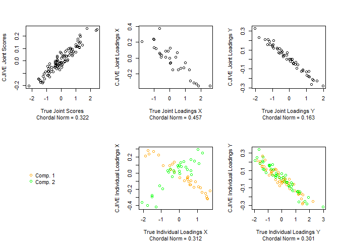<!-- -->

Now, compute the PJIVE solution and graph joint subject scores (not
individual scores) in addition to joint and individual loadings.

``` r
##### ProJIVE
PJIVE.res = ProJIVE_EM(Y=Y, P=P, Q=Q, Max.iter=10000, diff.tol=1e-5)
```

    ## [1] "Total Iteration = 6"
    ## [1] "Observed Data Likelihood = -26226.9837087252"
    ## [1] "Complete Data Likelihood = -26095.9046874746"
    ## [1] "Chordal Norm = 0.000252982203882036"

<!-- -->

``` r
PJIVE.scores = PJIVE.res$SubjectScoreMatrix
PJIVE.loads.X = PJIVE.res$LoadingMatrix[1:p1,-(sum(Q):(sum(Q[-3])+1))]
PJIVE.loads.Y = PJIVE.res$LoadingMatrix[-(1:p1),-(r.J+1:r.I1)]
```

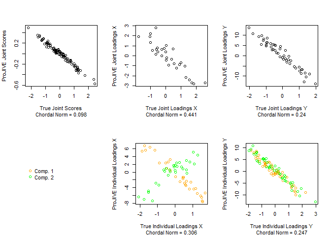<!-- -->

## Gaussian Mixture Scores

When study participants can be categorized due to an exogenous variable
that is associated with the joint sources of variation (i.e. diagnosis
categories, etc.), joint subject scores may be used to categorize
participants. The code snippet here generates toy data that reflect this
scenario by taking joint subject scores from Gaussian mixture model.

``` r
true_signal_ranks = r.J + c(r.I1,r.I2)                          ##true ranks of overall signals
ToyDat = GenerateToyData(n = n, p1 = p1, p2 = p2, JntVarEx1 = JntVarEx1, JntVarEx2 = JntVarEx2, 
                         IndVarEx1 = IndVarEx1, IndVarEx2 =  IndVarEx2, jnt_rank = r.J,
                         equal.eig = F,ind_rank1 = r.I1, ind_rank2 = r.I2, JntVarAdj = T, SVD.plots = T,
                         Error = T, print.cor = F, Loads = "Gaussian", Scores = "Gaussian_Mixture")
```

    ## [1] "Generating Scores from Gaussian_Mixture distribution and Loadings from Gaussian"

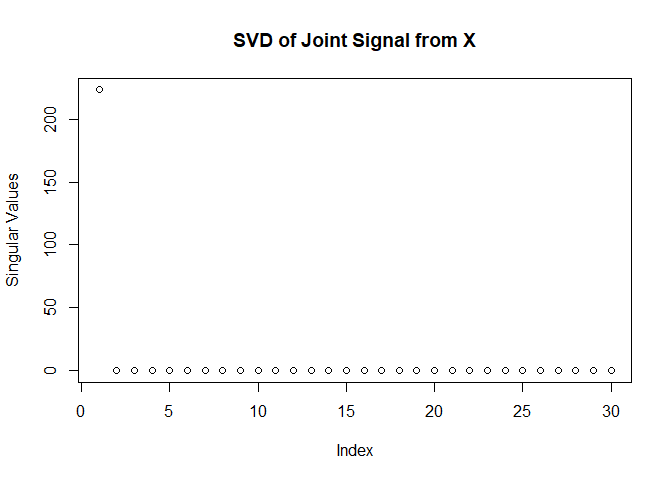<!-- -->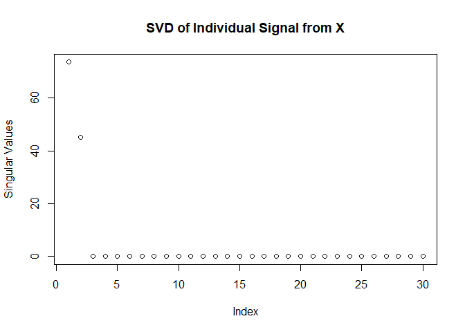<!-- -->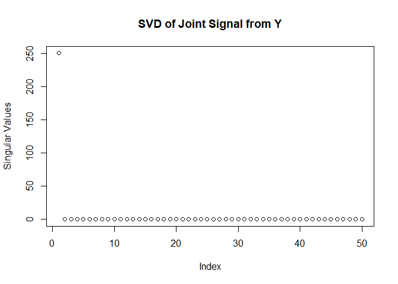<!-- -->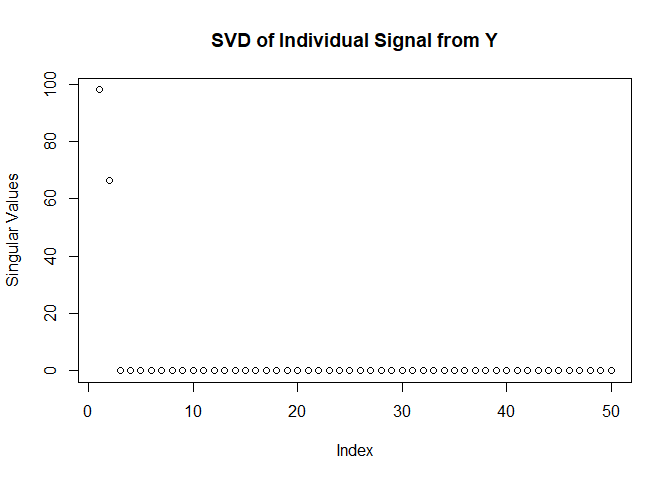<!-- -->

Check that values of \(R_{Jk}^2\) and \(R_{Ik}^2\) in the simulated data
match the desired quantities.

    ## paste(R[JX]^2, "=", 0.0499)

    ## paste(R[JY]^2, "=", 0.0499)

    ## paste(R[IX]^2, "=", 0.2495)

    ## paste(R[IY]^2, "=", 0.2495)

Now, compute the CJIVE solution and graph joint subject scores (not
individual scores) in addition to joint and individual loadings.

``` r
#### CJIVE
CJIVE.res = cc.jive(blocks, true_signal_ranks, r.J, perm.test = FALSE)

# CJIVE signal matrix estimates
J.hat = CJIVE.res$sJIVE$joint_matrices
I.hat = CJIVE.res$sJIVE$indiv_matrices

# CJIVE loading estimates
WJ = lapply(J.hat, function(x) x[['v']])
WI = lapply(I.hat, function(x) x[['v']])
```

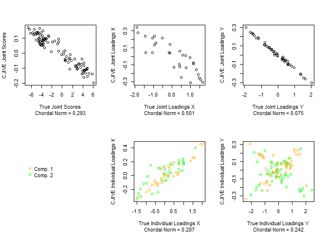<!-- -->

Now, compute the PJIVE solution and graph joint subject scores (not
individual scores) in addition to joint and individual loadings.

``` r
##### ProJIVE
PJIVE.res = ProJIVE_EM(Y=Y, P=P, Q=Q, Max.iter=1000, diff.tol=1e-5)
```

    ## [1] "Total Iteration = 6"
    ## [1] "Observed Data Likelihood = -26255.7555008525"
    ## [1] "Complete Data Likelihood = -26119.8725826767"
    ## [1] "Chordal Norm = 0.000389871743760824"

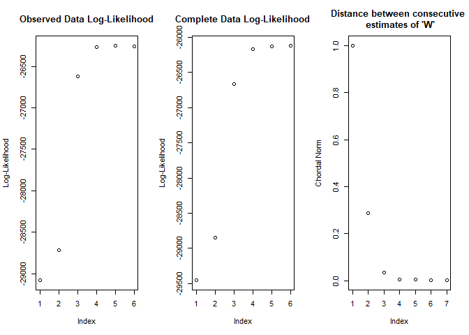<!-- -->

``` r
PJIVE.scores = PJIVE.res$SubjectScoreMatrix
PJIVE.loads.X = PJIVE.res$LoadingMatrix[1:p1,-(sum(Q):(sum(Q[-3])+1))]
PJIVE.loads.Y = PJIVE.res$LoadingMatrix[-(1:p1),-(r.J+1:r.I1)]
```

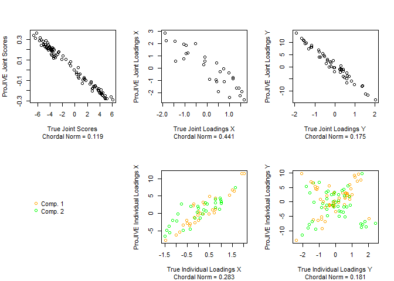<!-- -->

We can also check the histogram of joint scores from each method for the
multimodality that arises from Gaussian mixtures and check that there is
a statisically significant association between joint scores and group
asignment based on the miture model.

``` r
## Proportions of groups for mixture
mix.probs = c(0.2, 0.5, 0.3)
n.mix = n*mix.probs
mix.group = factor(c(rep(1, n.mix[1]),rep(2, n.mix[2]),rep(3, n.mix[3])))
JntScores.dat = data.frame(V1 = c(CJIVE.res$CanCorRes$Jnt_Scores, PJIVE.scores[,1:r.J]))
JntScores.dat$group = factor(c(mix.group, mix.group), labels = paste("Group", 1:3))
JntScores.dat$Method = factor(rep(1:2, each = n), labels = c("CJIVE", "ProJIVE"))
ggplot(data = JntScores.dat, aes(V1, fill = group)) + geom_histogram(bins = 20, position = "dodge") + facet_wrap(Method~.)
```

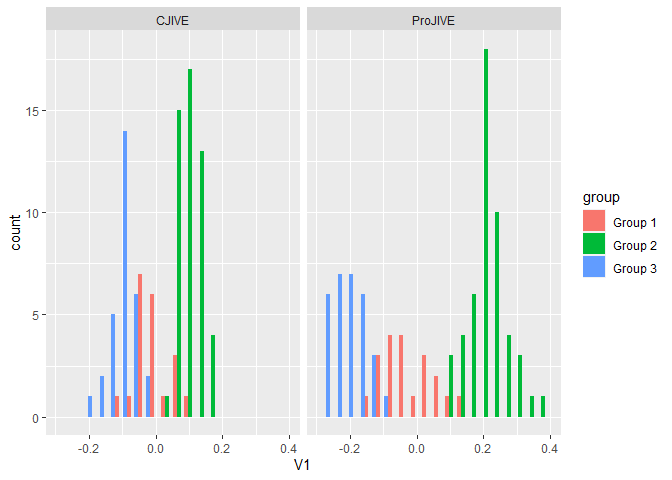<!-- -->
